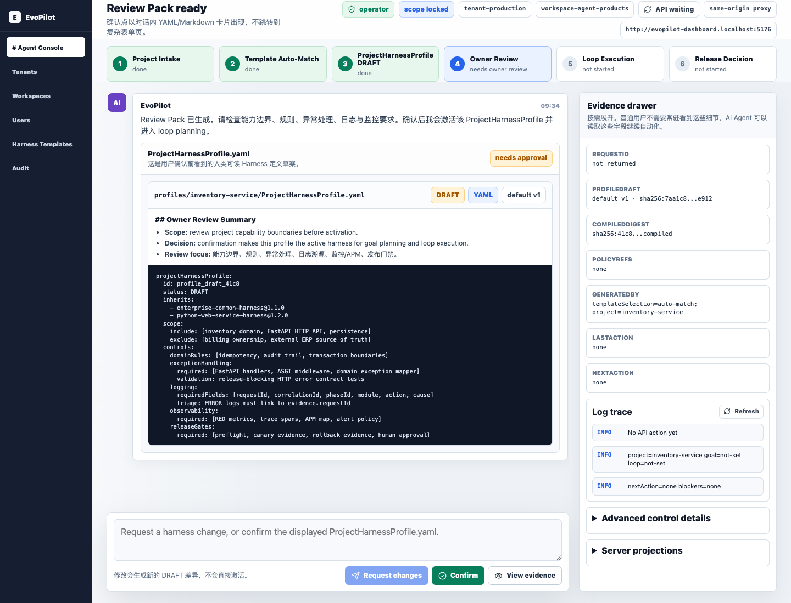

<div align="center">

# EvoPilot Dashboard

**The self-hosted Agent Console for EvoPilot-governed project intake, harness review, and loop execution.**

[](https://github.com/yeliang-wang/evopilot-dashboard/actions/workflows/ci.yml)
[](https://nodejs.org/)
[](https://react.dev/)
[](./docs/releases/1.0.6.md)
[](LICENSE)

Admins provision scoped users. Users sign in, connect GitHub/GitLab projects, describe goal loop targets, review EvoPilot-generated `ProjectHarnessProfile.yaml` drafts, and run governed loops from a browser.

[Quickstart](./docs/getting-started.md) | [Distribution](./docs/operations/distribution.md) | [Self-Hosting](./docs/operations/self-hosting.md) | [Docs](./docs/README.md) | [User Guide](./docs/user-guide.md) | [AI Agents](./docs/ai-agents/README.md) | [Changelog](./CHANGELOG.md) | [Security](./SECURITY.md)



</div>

## Start Here

| Entry | Use when | Command |
| --- | --- | --- |
| Run Dashboard | You have an EvoPilot API server and want the browser surface in one command | `npm run dashboard:run -- --api-url http://127.0.0.1:19876 --start` |
| Self-host with EvoPilot | You want the API and Dashboard in one generated stack | `npx create-evopilot@1.0.8 self-host --dir evopilot-stack --init-env` |
| Connect to API | You deploy Dashboard as static assets behind a proxy | `window.EVOPILOT_DASHBOARD_CONFIG = { apiBaseUrl: "" }` |

Desktop app and hosted Cloud trial are not published Dashboard surfaces yet. The supported public entry points are local browser run, self-hosted stack, and static deployment connected to EvoPilot API.

## Overview

EvoPilot Dashboard is the login-scoped browser product surface for EvoPilot. It gives administrator-provisioned users one guided path:

```text
Admin provisions user -> User logs in -> Project intake -> Template auto-match
-> ProjectHarnessProfile.yaml DRAFT -> Owner review -> Loop execution -> Release decision
```

EvoPilot automatically matches the `HarnessTemplate`, combines it with repository context and the goal loop target, and returns a human-readable `ProjectHarnessProfile.yaml` DRAFT. Users can request changes or confirm it. Only the reviewed profile can be activated and used for phase planning, loop execution, evidence review, blocker repair, and release decisions.

EvoPilot API remains the system of record. Dashboard is a standalone React HTTP client; it does not own project, harness, loop, evidence, audit, release, user, tenant, or credential state.

Login is the first screen. The left navigation follows the fixed product baseline: `# Agent Console`, `Tenants`, `Workspaces`, `Users`, `Harness Templates`, and `Audit`. Project context, sessions, decisions, and evidence stay inside the main console or drawer, not in the sidebar.

## Core Capabilities

| Area | What the Dashboard does |
| --- | --- |
| Agent Console | Project intake, goal loop target submission, harness draft review, and loop operation in one chat-first workspace. |
| Harness governance | EvoPilot auto-matches templates; users review `ProjectHarnessProfile.yaml` before activation. |
| Evidence | Request IDs, digests, policy refs, logs, blockers, `nextAction`, release decisions, and token usage in the Evidence Drawer. |
| Auth and scope | Login-first operation with tenant/workspace/actor scope locked by EvoPilot. |
| Admin pages | Tenants, workspaces, users, harness template evolution, and audit for permitted roles. |
| AI Agent operation | WorkBuddy-readable docs, page maps, expected states, API mapping, and stop rules. |

## Quickstart

Prerequisites: a running EvoPilot API server, an administrator-provisioned Dashboard user, tenant/workspace context, Node.js 22, and npm.

```bash
git clone git@github.com:yeliang-wang/evopilot-dashboard.git
cd evopilot-dashboard
npm ci
EVOPILOT_API_BASE_URL=http://127.0.0.1:19876 npm run dev -- --port 5174
```

Open `http://127.0.0.1:5174`.

For same-origin production deployments, keep `public/config.js` as:

```js
window.EVOPILOT_DASHBOARD_CONFIG = {
  apiBaseUrl: ""
};
```

Use an absolute `apiBaseUrl` only when CORS is configured on the EvoPilot API server.

## Architecture

```text
Browser -> Dashboard static assets -> src/api.ts -> EvoPilot API
```

CLI and Dashboard are two adapters over the same EvoPilot server state. Dashboard must not call the EvoPilot CLI, read EvoPilot local data files, bypass RBAC, skip tenant/workspace scope, activate unreviewed harness profiles, or continue past server blockers.

## Development

```bash
npm run check
npm run verify:distribution
npm run smoke:console
npm run release:artifact
npm run verify:release-artifact
```

`npm run check` runs typecheck, production build, static contract tests, governance checks, and distribution verification. Use mutating smoke only against disposable or explicitly approved test data:

```bash
EVOPILOT_MUTATING_SMOKE=1 npm run smoke:console
```

## More Docs

- [Documentation index](./docs/README.md)
- [End-to-end scenarios](./docs/workflows/end-to-end-scenarios.md)
- [AI Agent browser operation guide](./docs/ai-agents/README.md)
- [API usage map](./docs/reference/api-usage.md)
- [Self-hosting](./docs/operations/self-hosting.md)
- [Release management](./docs/operations/release-management.md)
- [Smoke test guide](./docs/operations/smoke-test.md)
- [Open source readiness](./docs/reference/open-source-readiness.md)
- [Open source maturity report](./docs/reference/open-source-maturity-report.md)

## License

Apache-2.0, matching [EvoPilot](https://github.com/yeliang-wang/evopilot).
